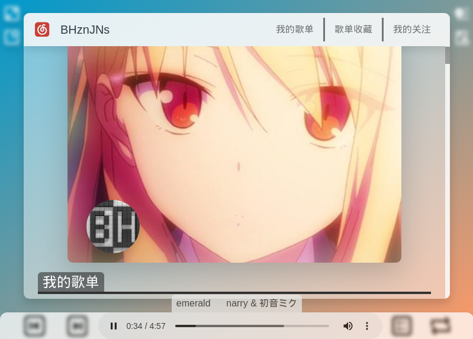
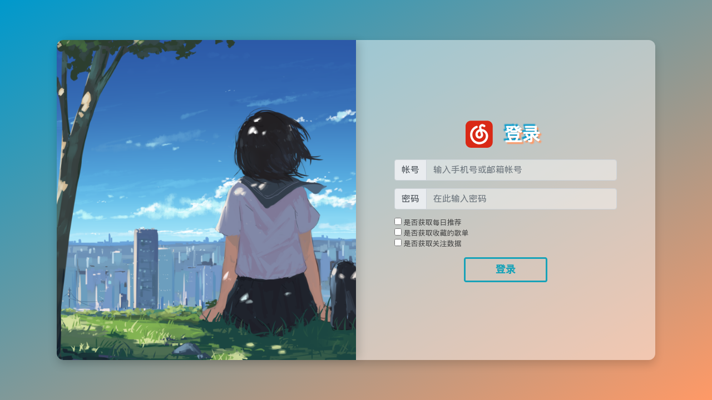
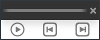

<h1>BloudMusic</h1>
<h3>简介</h3>

一个第三方的网易云音乐客户端，使用 Electron.js 开发

基于这位大佬写的 api <a href="https://github.com/Binaryify/NeteaseCloudMusicApi">Binaryify / NeteaseCloudMusicApi</a>开发，在此致谢。

<h3>屏幕截图</h3>

<h3>使用方法</h3>
<ul>
  <li><b>现在你可以在解压源码包后使用 <code>./install.sh</code> 来安装了(记得给文件运行权限)</b></li>
  <li><a href="https://nodejs.org/en/download/">到此</a>下载并安装 Node.js</li>
  <li><a href="https://github.com/BHznJNs/BloudMusic/releases/">到此</a>下载并解压源码压缩包</li>
  <li>打开你的 终端/terminal/cmd/powershell ，<code>cd</code> 进入解压目录，如 <code>cd ~/BloudMusic</code> </li>
  <li>输入 <code>npm install</code> 以安装依赖（Electron 有时会安装失败，你可能需要 <code>cd</code> 到 node_module 中的 electron 使用 <code>node install.js</code> 以安装 Electron）</li>
  <li><a href="https://github.com/Binaryify/NeteaseCloudMusicApi">到此</a>下载 api 包，解压后移动至项目文件夹</li>
  <li>进入 api 包，用 npm 安装 express，并将 app.js 改名为 NCMapi.js (防止运行时与其它 js 脚本撞名)</li>
  <li>输入 <code>npm start</code> 以运行程序 (如果出现类似 <code>Error: Cannot find module '/home/pi/BloudMusic-1.4.0/NeteaseCloudMusicApi-master/NCMapi.js'</code> 报错，请将 <code>package.json</code> 文件中第14行和第16行的 “NeteaseCloudMusicApi” 改为 “NeteaseCloudMusicApi-master”)</li>
</ul>

<h3>注：</h3>
<ul>
  <li>本项目适合爱折腾的用户使用（折腾本项目需要一定的 CSS 和 Javascript 基础）</li>
  <li>本项目未加入任何社交功能</li>
  <li>本项目仍处于开发中</li>
</ul>

<h3>以下功能已实现：</h3>
<ul>
  <li>在页面中加入用户头图和背景图作为装饰</li>
  <li>用户创建歌单播放</li>
  <li>用户收藏歌单播放(因为 api 的缘故，只能获取歌单前20首。之后会改进)</li>
  <li>用户关注及收藏歌手的热门歌曲播放</li>
  <li>当前播放列表的图形化显示</li>
  <li>单曲切换喜欢状态</li>
  <li>屏幕悬浮部件</li>
  <li>播放模式切换(播放列表循环、单曲循环、随机播放)</li>
  <li>使用 Bootstrap Toasts 组件进行提示</li>
  <li>...</li>
</ul>

<h3>TODO</h3>
<ul>
  <li>实现类似 iPad 版网易云音乐客户端的分屏效果</li>
  <li>查看历史日推功能</li>
  <li>歌手单击名字打开详情页</li>
  <li>黑暗模式</li>
  <li>歌单编辑</li>
  <li>歌词显示</li>
  <li>设置界面</li>
  <li>...</li>
</ul>
