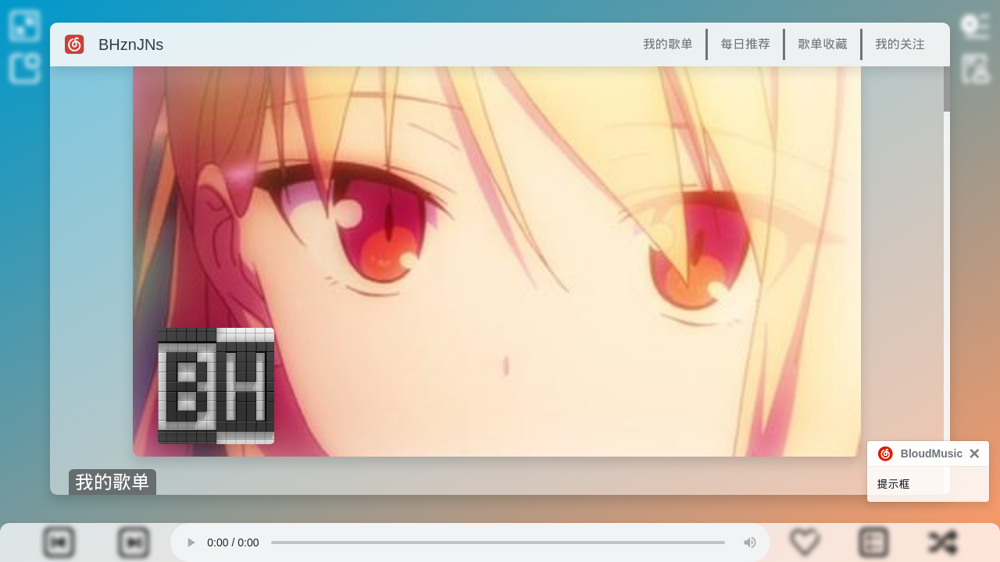

<h1>BloudMusic</h1>

抛弃累赘功能，追求纯粹的音乐体验。

<h2>简介</h2>

一个个人开发的第三方网易云音乐客户端，使用 Electron.js 开发

基于这位大佬写的 api <a href="https://github.com/Binaryify/NeteaseCloudMusicApi">Binaryify / NeteaseCloudMusicApi</a>开发，在此致谢

<h2>屏幕截图</h2>

<h2>使用方法</h2>
<ul>
  <h3>脚本安装</h3>
  <li><b>在解压源码包后在项目目录中使用 <code>./install.sh</code> (记得给文件运行权限)</b></li>
  
  ————————————————————————————————————————
  
  <h3>手动安装</h3>
  <li><a href="https://nodejs.org/en/download/">到此</a>下载并安装 Node.js</li>
  <li><a href="https://github.com/BHznJNs/BloudMusic/releases/">到此</a>下载并解压源码压缩包</li>
  <li>打开你的 终端/terminal/cmd/powershell ，<code>cd</code> 进入解压目录，如 <code>cd ~/BloudMusic</code> </li>
  <li>输入 <code>npm install</code> 以安装依赖（Electron 有时会安装失败，你可能需要 <code>cd</code> 到 node_module 中的 electron 使用 <code>node install.js</code> 以安装 Electron）</li>
  <li><a href="https://github.com/Binaryify/NeteaseCloudMusicApi">到此</a>下载 api 包，解压后移动至项目文件夹</li>
  <li>进入 api 包，用 npm 安装 express，并将 app.js 改名为 NCMapi.js (防止运行时与其它 js 脚本撞名)</li>
  <li>输入 <code>npm start</code> 以运行程序 (如果出现类似 <code>Error: Cannot find module '/home/pi/BloudMusic-1.4.0/NeteaseCloudMusicApi-master/NCMapi.js'</code> 报错，请将 <code>package.json</code> 文件中第14行和第16行的 “NeteaseCloudMusicApi” 改为 “NeteaseCloudMusicApi-master”)</li>
</ul>

<h2>键盘快捷键一览表</h2>
<table>
  <tr>
    <td>Esc | Escape</td>
    <td>打开播放小控件</td>
  </tr>
  <tr>
    <td>空格 | Blank_space</td>
    <td>暂停 / 继续播放</td>
  </tr>
  <tr>
    <td>Alt + P</td>
    <td>切换播放列表 打开 / 关闭</td>
  </tr>
  <tr>
    <td>Ctrl + T</td>
    <td>切换播放模式</td>
  </tr>
  <tr>
    <td>数字小键盘2</td>
    <td>降低音量</td>
  </tr>
  <tr>
    <td>数字小键盘8</td>
    <td>提高音量</td>
  </tr>
  <tr>
    <td>数字小键盘4</td>
    <td>上一首</td>
  </tr>
  <tr>
    <td>数字小键盘6</td>
    <td>下一首</td>
  </tr>
  <tr>
    <td>F11</td>
    <td>切换全屏</td>
  </tr>
  <tr>
    <td>...</td>
  </tr>
</table>

<h2>注：</h2>
<ul>
  <li>本项目适合爱折腾的用户使用（折腾本项目需要一定的 CSS 和 Javascript 基础）</li>
  <li>本项目未加入任何社交功能（以后也大概率不会加入）</li>
  <li>本项目未加入任何 mv 相关功能（以后也大概率不会加入）</li>
  <li>本项目仍处于开发中</li>
  <li>对于同一首歌，请勿频繁<b>切换喜欢状态</b>（之后可能会改动），由于 NeteaseCloudMusicApi 的缓存机制，可能导致操作无法成功</li>
  <li>开发及测试使用树莓派4B，所以兼容性可能不会很好，但优化应该OK</li>
</ul>

<h2>以下功能已实现：</h2>
<ul>
  <li>在页面中加入用户头图和背景图作为装饰</li>
  <li>用户创建歌单播放</li>
  <li>用户收藏歌单播放</li>
  <li>每日推荐单曲获取</li>
  <li>用户关注及收藏歌手的热门歌曲播放</li>
  <li>当前播放列表的图形化显示</li>
  <li>单曲喜欢状态切换</li>
  <li>播放模式切换(循环、随机、单曲循环)</li>
  <li>屏幕悬浮部件(默认位于屏幕左上角且大小为200×80，之后会在设置界面实现自定义位置和大小)</li>
  <li>播放模式切换(播放列表循环、单曲循环、随机播放)</li>
  <li>使用 Bootstrap Toasts 组件进行提示</li>
  <li>类似 iPad HD 版网易云音乐客户端的分屏效果</li>
  <li>歌手单击名字打开详情页</li>
  <li>分屏内单击专辑名字打开专辑详情页</li>
  <li>...</li>
</ul>

<h2>TODO</h2>
<ul>
  <li>查看历史日推功能</li>
  <li>歌手切换关注状态</li>
  <li>黑暗模式</li>
  <li>歌单编辑(创建、删除、增加单曲、移除单曲、收藏、取消收藏)</li>
  <li>用户收藏专辑获取</li>
  <li>专辑编辑(收藏、取消收藏)</li>
  <li>歌词显示</li>
  <li>设置界面</li>
  <li>...</li>
</ul>
